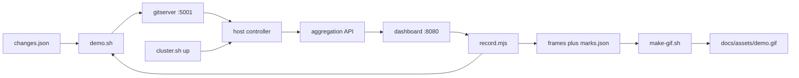

# Record the dashboard demo GIF

The GIF shows one change promoted through development, staging, and production, the code-reference tooltip, and the history drawer. Scripts live in `.agents/skills/record-ui-demo-gif/scripts/`. Run commands below from the repo root. `$S` is that directory:

```bash
S=.agents/skills/record-ui-demo-gif/scripts
```

```
scripts/
  cluster.sh      up | down [--all]
  demo.sh         seed | promote <n> [--wait] | reset
  changes.json    the four scripted commits (shared by demo.sh and record.mjs)
  gitserver/      gitkit on 127.0.0.1:5001
  manifests/demo.yaml
  record.mjs      Playwright storyboard; lossless frames + marks.json
  make-gif.sh     ffmpeg time-lapse, scale, palette -> docs/assets/demo.gif
```

## Architecture



`demo.sh` plays the Argo CD source hydrator: it pushes `hydrator.metadata` (dry commit plus `references[].commit`, which is the code commit on screen) and a short per-environment manifest to `environment/<env>` and `environment/<env>-next` on the local git server. The host controller, using the built-in fake SCM provider, opens and merges the pull requests. The dashboard reads the aggregated view API.

`record.mjs` drives the page and writes PNG frames, `frames.txt`, and `marks.json`. Each mark has a `maxDuration`; `make-gif.sh` plays longer segments as a time-lapse (`GIF_TIMELAPSE_FPS`) and leaves shorter ones in real time.

Change 0 in `changes.json` is the baseline `seed` deploys everywhere. Change 1 is promoted before recording so History is not empty. Change 2 is the take (`record.mjs` runs `demo.sh promote 2` itself). Change 3 is a spare.

## Invariants

These look removable and are not:

- The controller runs on the host, not in Tilt or the cluster. The fake SCM provider clones `http://localhost:5001/<owner>/<name>`. `cluster.sh up` scales an in-cluster `promoter-controller-manager` to 0; `down` restores the replica count.
- Requeue is 3s. The fake provider posts its webhook to port 3334, which nothing serves outside tests, so merges are noticed only on requeue.
- `TimedCommitStatus` soaks for 12s per environment. That pending-to-success beat is in the GIF.
- Frames are lossless CDP PNGs, and the browser context sets `reducedMotion: 'reduce'`. Playwright's webm recording made the GIF about ten times larger. The viewport is 1640x920 at CSS zoom 1.2 because three columns only appear above 1600 CSS px; the fake cursor's own zoom is `1/zoom` so it tracks the pointer.
- `marks.json` `maxDuration` is what turns controller waits into time-lapse. Clicks and the code-reference hover stay real time.
- `demo.sh reset` deletes the namespace while the controller is running, so the controller drops finalizers. `cluster.sh down` strips them itself, because the host processes are already stopped.

## Prerequisites

- A local Kubernetes context you can install CRDs into. `go`, `node` (>= 20), `kubectl`, `ffmpeg`, `jq`, `openssl`. `gifsicle` is optional.
- Ports 5001 (git), 8080 (dashboard), and 3333/9080/9081 (controller) free.

## Procedure

Each long-lived process gets its own terminal. In agent sessions, start them as background shells and check their logs before continuing.

1. `$S/cluster.sh up` — CRDs, `promoter-system` ControllerConfiguration with 3s requeue, aggregation apiserver, APIService Available. Idempotent.
2. `go run ./$S/gitserver`
3. `PATH="$PWD/hack/git:$PATH" go run ./cmd controller --namespace promoter-system` (add `--context <ctx>` if needed). Errors from unrelated namespaces are harmless.
4. `make build-dashboard-ui && go run ./cmd dashboard --port 8080` so the GIF matches the current tree.
5. `$S/demo.sh seed`, then `kubectl -n promoter-demo get promotionstrategy shop` is `READY True`.
6. `$S/demo.sh promote 1 --wait` (about a minute) so History has a completed row.
7. `cd "$S" && npm install && npx playwright install chromium && node record.mjs --change 2` (about two minutes; one timestamp per mark).
8. `$S/make-gif.sh` writes `docs/assets/demo.gif`. Spot-check a frame: `ffmpeg -y -ss 10 -i docs/assets/demo.gif -frames:v 1 /tmp/frame.png`
9. Another take: `$S/demo.sh reset`, then step 7 again. Use `--change 3` to skip the reset.
10. Stop the three processes, then `$S/cluster.sh down`. `--all` also removes the apiserver, ControllerConfiguration, namespace, and CRDs.

The GIF is referenced by `README.md` (`docs/assets/demo.gif`) and `docs/getting-started.md` (`assets/demo.gif`). Keep the alt text in sync if the storyboard changes.

## Storyboard

| mark | on screen | max seconds |
|---|---|---|
| `namespace` | pick `promoter-demo`, click the `shop` tile | 5 |
| `overview` | steady state; `demo.sh promote` starts | 3 |
| `proposed` | proposed card; hover the code commit | real time |
| `promote-*` | one environment, until its active card shows the new subject | 3 each |
| `settled` | all environments on the new change | 2.5 |
| `history` / `history-drawer` | History tab; newest cell; drawer with "Referenced commits" | real time |

Edit `mark(name, maxDuration)` in `record.mjs` to change pacing. Edit `changes.json` to change subjects, bodies, and the code commit.

## Size

Target about 500 KB and 30 seconds. Defaults are 1100 px, 10 fps, 128 colours, roughly 360 KB. Time-lapse segments dominate the size: lower `GIF_TIMELAPSE_FPS` (8) or the `promote-*` `maxDuration` first, then `GIF_WIDTH`, `GIF_COLORS`, and `GIF_FPS`. Dithering is off (`dither=none`). `gifsicle -O3 --lossy` (`GIF_LOSSY`, default 40) runs when `gifsicle` is installed.

## Troubleshooting

- Dashboard stays on "Loading promotion strategies": `kubectl get apiservice v1alpha1.view.promoter.argoproj.io` must be `Available True`. Re-run `$S/cluster.sh up`. If the released `:latest` apiserver image lags the view API on main, use `make run-apiserver` and `hack/apiserver-local-register.sh` instead.
- No PullRequest after `demo.sh promote`: controller log shows `localhost:5001` clone errors (git server down), or the 3s requeue patch did not apply.
- `promote --wait` times out: `kubectl -n promoter-demo get ctp,pr,commitstatus`. The `soak` TimedCommitStatus must succeed before the next environment merges.
- PR numbers repeat (`#4` on every card): the fake provider's IDs come from an in-memory map. Restarting the controller resets them.
- Playwright cannot find the browser: `npx playwright install chromium` in the same environment as `node record.mjs` (`PLAYWRIGHT_BROWSERS_PATH` must match).
