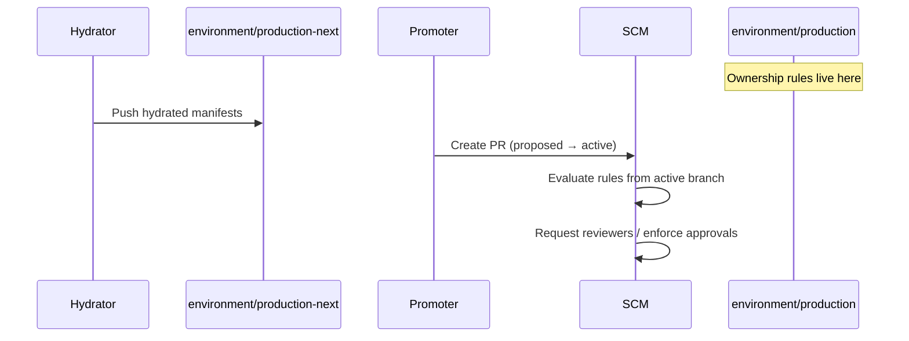

# Promotion PR Reviewers via SCM Code Ownership

GitOps Promoter opens promotion pull requests from each environment's **proposed** branch
(for example `environment/production-next`) into its **active** branch
(`environment/production`). You can route those PRs to the right people for review by
placing ownership rules on the **active branch** and letting the SCM assign reviewers
natively—without adding `pullRequest.reviewers` to `PromotionStrategy` or calling
reviewer APIs from the controller.

This page documents that approach as an alternative to API-managed reviewers
([issue #1881](https://github.com/argoproj-labs/gitops-promoter/issues/1881),
[PR #2002](https://github.com/argoproj-labs/gitops-promoter/pull/2002)). Reviewer policy
lives in Git (or, for Azure DevOps, in branch policies), not in Kubernetes CRDs.

> [!IMPORTANT]
> **Provider coverage is not uniform.** GitHub, GitLab (with settings), Gitea, Forgejo,
> and Azure DevOps (via branch policies) apply ownership rules to API-created promotion
> PRs. **Bitbucket Cloud is the outlier:** official docs describe automatic reviewer
> assignment from `.bitbucket/CODEOWNERS`, but Atlassian has confirmed that path-based
> CODEOWNERS and repository default reviewers are **not** applied when a PR is created
> via `POST …/pullrequests` (how Promoter works). See [Bitbucket Cloud](#bitbucket-cloud)
> for the full evidence, a verification procedure, and workarounds.

## How promotion PRs interact with ownership rules

| Concept | Promoter term | Example |
|---------|---------------|---------|
| Merge target (base) | Active branch | `environment/production` |
| Merge source (head) | Proposed branch | `environment/production-next` |

Every supported SCM reads ownership configuration from the **destination / base / target
branch** of the pull request. Rules committed only on `-next` proposed branches are
ignored until they merge into the active branch.



Promoter creates PRs with `Create(title, sourceBranch, targetBranch, …)` and does not
pass reviewers. Whether reviewers appear depends entirely on SCM-side configuration.

## Where to put ownership configuration

### Pattern A: Bootstrap on active branches (recommended)

Commit the ownership file **once per active branch**, outside the hydration loop.
Hydrated output on `-next` branches does not include the file, so routine promotions do
not overwrite it.

Use this when reviewers are stable per environment and you want the simplest operational
model.

### Pattern B: Per-environment file in the DRY repo (hydrator-managed)

Store environment-specific ownership in the DRY branch; the hydrator emits the correct
file into each `-next` branch's hydrated tree. The file merges onto the active branch
with the promotion.

Use this when ownership should be versioned with application configuration. Protect the
file from accidental drift and expect it to appear in promotion PR diffs.

### Pattern C: Monorepo with `activePath`

When multiple `PromotionStrategy` resources share one active branch via
`spec.activePath`, scope rules to each application's path under that branch. See
[Monorepo example](#monorepo-activepath-example) below.

### Pairing with `autoMerge`

| `autoMerge` | Typical behavior |
|-------------|------------------|
| `false` | Reviewers are requested; humans merge when satisfied (and branch protection allows). |
| `true` | Promoter merges when commit-status gates pass. Branch protection or required approvals can still block auto-merge until owners approve—usually desirable for production. |

For environments that should never wait on human review, omit ownership rules on that
active branch and/or do not require owner approval in branch protection.

---

## Provider reference

The table summarizes how each GitOps Promoter SCM provider supports this pattern.
Details and examples follow.

| Provider | Mechanism | File / config location | API-created PRs | Required tier / notes |
|----------|-----------|------------------------|-----------------|----------------------|
| [GitHub](#github) | `CODEOWNERS` | `.github/CODEOWNERS`, `docs/CODEOWNERS`, or root | **Yes** | Teams need `write` on the repo |
| [GitLab](#gitlab) | `CODEOWNERS` + project settings | `./CODEOWNERS`, `./docs/CODEOWNERS`, `./.gitlab/CODEOWNERS` | **Yes** (with settings) | Premium+ for Code Owner approvals; auto-assign reviewers is Premium/Ultimate |
| [Gitea](#gitea) | `CODEOWNERS` | `./CODEOWNERS`, `./docs/CODEOWNERS`, `./.gitea/CODEOWNERS` | **Yes** | Go regexp syntax; WIP PRs skip until ready |
| [Forgejo](#forgejo) | `CODEOWNERS` | root, `docs/`, or `.forgejo/` | **Yes** | Same model as Gitea |
| [Bitbucket Cloud](#bitbucket-cloud) | `.bitbucket/CODEOWNERS` | `.bitbucket/CODEOWNERS` (+ optional `teams.yaml`) | **No** (see [verification](#verify-bitbucket-codeowners-with-the-rest-api)) | UI PR creation only per Atlassian; [BCLOUD-23663](https://jira.atlassian.com/browse/BCLOUD-23663) open |
| [Azure DevOps](#azure-devops) | Branch policies | No `CODEOWNERS` file—use **Automatically included reviewers** on branch | **Yes** | Policy is server-side; path filters optional |

---

## GitHub

**Documentation:** [About code owners](https://docs.github.com/en/repositories/managing-your-repositorys-settings-and-features/customizing-your-repository/about-code-owners)

### Behavior

- When a pull request modifies files matched by `CODEOWNERS`, GitHub **automatically
  requests review** from the listed users or teams.
- The file on the **base branch** (Promoter's active branch) is used. Each branch can
  have its own `CODEOWNERS`.
- Works for PRs created through the REST API (how Promoter opens promotion PRs).
- Draft PRs do not trigger code-owner requests until marked ready for review.

### File locations (first match wins)

1. `.github/CODEOWNERS`
2. `CODEOWNERS` (repository root)
3. `docs/CODEOWNERS`

### Syntax (gitignore-style paths)

```
# .github/CODEOWNERS on branch environment/production

# All promotion changes (typical catch-all for hydrated trees)
*  @my-org/release-managers @my-org/security-compliance

# Monorepo: scope to one app
/apps/payments/**  @my-org/payments-oncall
```

- Users: `@username`
- Teams: `@org/team-slug` (team must have explicit **write** access to the repository)
- Email addresses are supported for users who have added the email to their account
- Last matching pattern wins (like `.gitignore`)
- `!` negation and `[ ]` character ranges from gitignore **do not** work in `CODEOWNERS`

### Branch protection

On each active environment branch, enable:

- **Require a pull request before merging**
- **Require review from Code Owners** (optional but common for production)

When "Require review from Code Owners" is enabled, **one** approval from any matching
owner satisfies the rule (not every listed owner).

### Promotion example

```yaml
# PromotionStrategy — no reviewer fields required
apiVersion: promoter.argoproj.io/v1alpha1
kind: PromotionStrategy
metadata:
  name: my-app
spec:
  gitRepositoryRef:
    name: my-repo
  environments:
    - branch: environment/development
      autoMerge: true
    - branch: environment/production
      autoMerge: false
```

Bootstrap on `environment/production`:

```text
# .github/CODEOWNERS
*  @my-org/release-managers
```

When Promoter opens `environment/production-next` → `environment/production`, GitHub
requests `@my-org/release-managers` for review.

### Limitations

- Code owners must have **write** access; invisible teams are skipped.
- `CODEOWNERS` files larger than 3 MB are not loaded.
- If both Promoter API reviewers (future) and `CODEOWNERS` are used, GitHub may assign
  overlapping reviewer sets; prefer one mechanism.

---

## GitLab

**Documentation:**

- [Code Owners](https://docs.gitlab.com/ee/user/project/codeowners/)
- [Automatic reviewer assignment](https://docs.gitlab.com/user/project/merge_requests/reviews/automatic_reviewer_assignment/)
- [Merge request approvals](https://docs.gitlab.com/ee/user/project/merge_requests/approvals/)

### Two related features

GitLab separates **reviewers** (people asked to look at the MR) from **approvers**
(people whose approval satisfies merge requirements):

| Feature | Purpose | Tier |
|---------|---------|------|
| **Code Owner approval rules** | Require owners of changed paths to approve before merge | Premium, Ultimate |
| **Automatic reviewer assignment** | Add Code Owners as **reviewers** when an MR is created | Premium, Ultimate |

For promotion PRs you typically want **both**: enable automatic reviewer assignment so
people are notified, and protect the active branch with Code Owner approvals so merge
is blocked until they approve.

### Behavior

- `CODEOWNERS` on the **target branch** must exist **before** the merge request is
  created. Updating `CODEOWNERS` after the MR is open does not refresh rules—close and
  recreate the MR.
- Code Owner approval rules are generated when the MR is created (API-created MRs
  included).
- Automatic reviewer assignment runs when:
  - An MR is created in ready state, or
  - A draft MR is marked ready
- GitLab assigns **every** Code Owner matching changed files (unless using the
  separate "Recommend Reviewers" Duo flow).

### Enable automatic reviewer assignment

1. **Settings → Merge requests**
2. **Automatic reviewer assignment → Automatically assign all code owners as reviewers**
3. Save

### File locations (first match wins)

1. `./CODEOWNERS`
2. `./docs/CODEOWNERS`
3. `./.gitlab/CODEOWNERS`

### Syntax

```
# CODEOWNERS on branch environment/production

# Catch-all for promotion PRs
*  @group/release-managers

# Optional sections
[Payments]
/apps/payments/  @group/payments-oncall
```

- Users: `@username`
- Groups: `@group-name` (group members must be **direct** project members for
  approvals—parent-group inheritance does not apply to Code Owner rules)

### Protected branches

For each active environment branch:

1. **Settings → Repository → Protected branches** — protect `environment/production`
2. Enable **Code owner approval required** on that branch

### Promotion example

Commit on `environment/production`:

```text
# CODEOWNERS
*  @my-group/release-managers
```

With automatic reviewer assignment enabled, Promoter's API-created MR from
`environment/production-next` gets `@my-group/release-managers` as reviewers and
Code Owner approval rules on the MR widget.

### Limitations

- Code Owners feature requires **Premium or Ultimate** (Free tier has optional
  approvals but not Code Owner enforcement).
- Groups referenced in `CODEOWNERS` must be invited to the project directly.
- `CODEOWNERS` on the default branch alone is **not** enough—you need the file on each
  active environment branch Promoter targets.

---

## Gitea

**Documentation:** [Code Owners](https://docs.gitea.com/usage/repository/code-owners),
[Protected branches](https://docs.gitea.com/usage/access-control/protected-branches)

### Behavior

- On pull request creation, Gitea parses `CODEOWNERS` from the **base branch** and
  **requests review** from matching users and teams.
- Works for API-created pull requests (Promoter's code path).
- **Work-in-progress** pull requests skip code-owner review requests until the WIP
  state is cleared.
- Owners need sufficient repository access (write permission for code ownership).

### File locations (first match wins)

1. `./CODEOWNERS`
2. `./docs/CODEOWNERS`
3. `./.gitea/CODEOWNERS`

### Syntax (Go regexp—not gitignore)

Each line: `<regexp> <@user or @org/team> …`

```
# .gitea/CODEOWNERS on branch environment/production

# Catch-all: any changed file
.*  @release-managers

# Per-path (escaped dots in extensions)
apps/payments/.*  @myorg/payments-team
```

- Prefix a pattern with `!` for negative rules (match when files do **not** match).
- Escape `#`, space, and `\` in patterns with `\`.
- Inside regex, escape `.+*?()|[]{}^$\` with `\\`.

### Branch protection

On the active branch, configure protected branch rules:

- **Required approvals** — minimum count before merge
- **Block merge on official review requests** — blocks merge while CODEOWNERS-requested
  reviews are outstanding

### Promotion example

```text
# .gitea/CODEOWNERS on environment/staging
.*  @platform-oncall
```

Promoter opens `environment/staging-next` → `environment/staging`; Gitea requests
`@platform-oncall`.

### Limitations

- Syntax differs from GitHub (Go regex vs gitignore paths)—do not copy a GitHub
  `CODEOWNERS` file verbatim without converting patterns.
- Self-hosted Gitea version must include the CODEOWNERS feature (merged in 1.20+).

---

## Forgejo

**Documentation:** [Pull requests and Git flow — Review requests and code owners](https://forgejo.org/docs/latest/user/collaboration/pull-requests-and-git-flow/)

Forgejo inherited Gitea's CODEOWNERS implementation. Behavior, regexp syntax, and
branch-protection options match [Gitea](#gitea) with one extra search path.

### File locations (first match wins)

1. Repository root `CODEOWNERS`
2. `docs/CODEOWNERS`
3. `.forgejo/CODEOWNERS` (Forgejo-specific; also supports `.gitea/CODEOWNERS` via Gitea
   compatibility)

### Example

```text
# .forgejo/CODEOWNERS on branch environment/production

# Request review for any promotion diff
.*  @MyOrg/release-managers

# Docs-only changes
docs/.*  @MyOrg/editors
```

Teams: `@org/team-name`. Users: `@username` or bare `username`.

### Limitations

Same as Gitea: Go regexp syntax, WIP suppression, write access required.

---

## Bitbucket Cloud

**Documentation:**

- [Set up and use code owners](https://support.atlassian.com/bitbucket-cloud/docs/set-up-and-use-code-owners/)
- [Use pull requests for code review](https://support.atlassian.com/bitbucket-cloud/docs/use-pull-requests-for-code-review/) (default reviewers + CODEOWNERS)
- [Pull requests REST API](https://developer.atlassian.com/cloud/bitbucket/rest/api-group-pullrequests/)
- [Suggest or require checks before a merge](https://support.atlassian.com/bitbucket-cloud/docs/suggest-or-require-checks-before-a-merge/)

Bitbucket is the most nuanced provider for this guide. The **product documentation**
describes CODEOWNERS as automatic for "newly created pull requests," but **does not
distinguish UI from REST API creation**. Separate Atlassian statements, open Jira
issues, and recent community reports all say API-created PRs do **not** get CODEOWNERS
reviewers. Treat Bitbucket as **unverified until you run the
[verification procedure](#verify-bitbucket-codeowners-with-the-rest-api)** on your
workspace.

### Current status (research as of September 2026)

| Source | What it says | Implication for Promoter |
|--------|--------------|--------------------------|
| [Support docs](https://support.atlassian.com/bitbucket-cloud/docs/set-up-and-use-code-owners/) | CODEOWNERS on the destination branch adds "suggested reviewers" when PRs are created | Ambiguous about API |
| [Atlassian staff (Apr 2024)](https://community.atlassian.com/forums/Bitbucket-questions/CODEOWNER-s-relation-to-quot-default-reviewer-quot-and-its/qaq-p/2676207) | "Neither users in CODEOWNERS nor default reviewers will be added when creating a PR via API" | Direct answer: API path excluded |
| [BCLOUD-23663](https://jira.atlassian.com/browse/BCLOUD-23663) | Feature request to apply CODEOWNERS on `POST …/pullrequests`; **unresolved** | No platform fix shipped yet |
| [BCLOUD-23804](https://jira.atlassian.com/browse/BCLOUD-23804) | CODEOWNERS also missing for PRs auto-created from commits in the web "Edit" flow; **unresolved** | Gap is broader than REST alone |
| [Community report (Aug 2026)](https://community.atlassian.com/forums/Bitbucket-questions/CODEOWNERS-not-working-for-PRs-created-through-API/qaq-p/3278166) | Same branch/target: UI PR gets reviewers, API PR does not; accepted answer points to BCLOUD-23663 | Reproduces Promoter's create path |
| [Bitbucket Cloud changelog](https://developer.atlassian.com/cloud/bitbucket/changelog/) | No entry through Aug 2026 announcing API CODEOWNERS support | No documented fix |

**Bottom line for GitOps Promoter:** Promoter calls
`POST /2.0/repositories/{workspace}/{repo_slug}/pullrequests` with `source` and
`destination` branches only—no `reviewers` field (see
`internal/scms/bitbucket_cloud/pullrequest.go`). Unless Atlassian has shipped a silent
fix in your workspace, **do not rely on `.bitbucket/CODEOWNERS` alone** for promotion PR
reviewers.

> [!NOTE]
> If you have seen CODEOWNERS reviewers appear on Promoter-opened Bitbucket PRs, please
> compare against the [verification procedure](#verify-bitbucket-codeowners-with-the-rest-api)
> below. Common explanations are UI-created test PRs, a Forge/marketplace app adding
> reviewers via `PUT`, or manually passing `reviewers` in a custom integration—not
> native CODEOWNERS evaluation on `POST`.

### Three different "reviewer" mechanisms (do not conflate them)

Bitbucket Cloud has overlapping concepts. Only the first is path-based like GitHub
CODEOWNERS:

| Mechanism | Configuration | Path-aware? | Applied on API `POST`? | Enforced at merge? |
|-----------|---------------|-------------|------------------------|-------------------|
| **CODEOWNERS** | `.bitbucket/CODEOWNERS` (+ optional `teams.yaml`) on destination branch | Yes | **No** (per Atlassian) | **No** — reviewers are suggestions; authors can remove them ([community discussion](https://community.atlassian.com/forums/Bitbucket-questions/Enforcing-Code-Owners-in-Bitbucket/qaq-p/2834490)) |
| **Default reviewers** | Repository / project settings | No (repo-wide) | **No** — UI suggests them; API omits them unless you add them | Partially — merge checks can require "approvals from default reviewers" but only for reviewers actually on the PR |
| **Manual API reviewers** | `reviewers` array on `POST` or `PUT` | N/A (you choose) | **Yes** — explicit UUIDs/`account_id` | Same as above |

Related API endpoints:

- `GET …/default-reviewers` — users configured as default reviewers for the repo
- `GET …/effective-default-reviewers` — default reviewers including project inheritance ([API docs](https://developer.atlassian.com/cloud/bitbucket/rest/api-group-pullrequests/#api-repositories-workspace-repo-slug-effective-default-reviewers-get))

Neither endpoint returns **path-derived CODEOWNERS matches**. Fetching effective default
reviewers and passing them in `POST` reproduces **static** default reviewers only—not
per-path CODEOWNERS rules.

### How CODEOWNERS works when it triggers (web UI today)

When the web "Create pull request" flow runs:

1. Bitbucket reads `.bitbucket/CODEOWNERS` (and `teams.yaml`) from the **destination
   branch**.
2. It diffs the PR and matches path patterns.
3. Matching owners are added as **suggested reviewers** on the creation form (and on the
   opened PR).
4. Default reviewers (if configured) are **additive** with CODEOWNERS matches.

File and syntax rules:

- **Location:** `.bitbucket/CODEOWNERS` at the repository root (directory name is
  `.bitbucket`, not `bitbucket`).
- **Destination branch:** rules on `environment/production` apply to PRs targeting that
  branch—same as other providers' active-branch model.
- **Pattern syntax:** `.gitignore`-like, with exceptions documented by Atlassian (no `!`
  negation, no `\#` escape, no `[ ]` character ranges).
- **Precedence:** **last matching pattern wins** (opposite of GitHub).
- **User references:** `user@example.com`, `@username`,
  `@workspace-slug/group-slug`.
- **Repo-local teams:** `@teams/team-name` via `.bitbucket/teams.yaml`.
- **Group strategies:** `:all`, `:random(N)`, `:least_busy(N)` on workspace groups or
  inline overrides.

Known CODEOWNERS bugs to avoid when testing:

- [BCLOUD-24065](https://jira.atlassian.com/browse/BCLOUD-24065) (fixed): `@username`
  entries inside `teams.yaml` could prevent **any** reviewers from being added—use email
  addresses in `teams.yaml` contributors if you hit this on older builds.
- Wildcard `*` rules are sometimes required where a more specific pattern fails to
  match ([community troubleshooting](https://community.atlassian.com/forums/Bitbucket-questions/CODEOWNERS-not-working/qaq-p/3241306)).

### Example ownership files (for when API support lands—or UI testing)

```text
# .bitbucket/CODEOWNERS on branch environment/production

# Catch-all for full-tree promotion diffs (start here when debugging)
*  release-lead@example.com @workspace-slug/release-managers:all

# Hydrated app subtree
/apps/payments/**  @teams/payments-oncall
```

With `teams.yaml`:

```yaml
# .bitbucket/teams.yaml
payments-oncall:
  contributors:
    - alice@example.com
    - bob@example.com
  reviews:
    strategy: least_busy
    select: 2
```

```text
# .bitbucket/CODEOWNERS
/apps/payments/**  @teams/payments-oncall
```

### Verify Bitbucket CODEOWNERS with the REST API

Run this on a repo where CODEOWNERS **already works** for a UI-created PR between the
same branches. It mirrors Promoter's create call (source + destination, no reviewers).

```bash
# 1. Confirm CODEOWNERS exists on the destination (active) branch
git fetch origin environment/production
git show origin/environment/production:.bitbucket/CODEOWNERS

# 2. Create a PR via REST API (same as Promoter — no reviewers in body)
curl -sS -X POST \
  -H "Authorization: Bearer ${BITBUCKET_API_TOKEN}" \
  -H "Content-Type: application/json" \
  "https://api.bitbucket.org/2.0/repositories/${WORKSPACE}/${REPO}/pullrequests" \
  -d '{
    "title": "CODEOWNERS API verification",
    "source": { "branch": { "name": "environment/production-next" } },
    "destination": { "branch": { "name": "environment/production" } }
  }' | jq '{id, title, reviewers: [.reviewers[]?.display_name]}'

# 3. Compare with a UI-created PR from the same source → destination
```

**Interpret results:**

| `reviewers` in API response | Likely meaning |
|----------------------------|----------------|
| Empty `[]` | CODEOWNERS not applied on API create (expected today) |
| Populated | Atlassian may have fixed BCLOUD-23663 in your workspace—update this doc and re-test Promoter PRs |
| Populated only after delay | Check again with `GET …/pullrequests/{id}`; async assignment is not documented |

Also verify the **UI control**: open the Bitbucket PR page for the API-created PR. If
the sidebar shows reviewers but the create response was empty, reviewers were added
after create (webhook/Forge app or delayed processing)—still not equivalent to native
CODEOWNERS-on-`POST`.

### What *does* work programmatically today

These are **not** CODEOWNERS, but they are the practical Bitbucket automation paths until
BCLOUD-23663 is resolved:

**1. Pass reviewers on create** ([API docs](https://developer.atlassian.com/cloud/bitbucket/rest/api-group-pullrequests/#api-repositories-workspace-repo-slug-pullrequests-post)):

```bash
curl -sS -X POST \
  -H "Authorization: Bearer ${BITBUCKET_API_TOKEN}" \
  -H "Content-Type: application/json" \
  "https://api.bitbucket.org/2.0/repositories/${WORKSPACE}/${REPO}/pullrequests" \
  -d '{
    "title": "Promotion with explicit reviewers",
    "source": { "branch": { "name": "environment/production-next" } },
    "destination": { "branch": { "name": "environment/production" } },
    "reviewers": [{ "uuid": "{user-uuid}" }]
  }'
```

Use Bitbucket **account UUIDs** (not usernames). The PR author cannot be a reviewer.

**2. Add reviewers after create** via `PUT …/pullrequests/{id}` with a `reviewers` array
([Forge example](https://community.atlassian.com/forums/Bitbucket-articles/Add-a-reviewer-to-a-PR-using-the-REST-API-and-Forge/ba-p/2495708)).

**3. Fetch static default reviewers**, then pass them on create:

```bash
curl -sS -H "Authorization: Bearer ${BITBUCKET_API_TOKEN}" \
  "https://api.bitbucket.org/2.0/repositories/${WORKSPACE}/${REPO}/effective-default-reviewers" \
  | jq '[.values[].user.uuid]'
```

This covers **repo/project default reviewers only**—not path-based CODEOWNERS. For
per-environment static lists it can be enough; for per-path ownership it is not.

**4. Forge / marketplace apps** — Apps can listen for `pullrequest:created` and `PUT`
reviewers. Some read a repo config file and approximate CODEOWNERS client-side. Outside
Promoter's scope but common in Bitbucket enterprises.

### Merge checks vs CODEOWNERS reviewers

[Merge checks](https://support.atlassian.com/bitbucket-cloud/docs/suggest-or-require-checks-before-a-merge/)
(for example "Minimum number of approvals from default reviewers") gate **merge** based on
who is on the PR—they do **not** auto-add CODEOWNERS reviewers to API-created PRs.
Premium merge checks can require default-reviewer approvals, but someone must still add
those reviewers to the PR first.

Third-party apps (for example Workzone) exist specifically because native CODEOWNERS
assigns reviewers without **enforcing** that those owners approved, and because
reviewers can be removed after assignment.

### Bitbucket Cloud workarounds for promotion PRs

Ranked by how closely they match #1881's goal (right people notified on API-created PRs):

1. **Promoter API-managed reviewers** ([#1881](https://github.com/argoproj-labs/gitops-promoter/issues/1881) /
   [PR #2002](https://github.com/argoproj-labs/gitops-promoter/pull/2002)) — Controller
   resolves reviewers and calls Bitbucket `POST`/`PUT` with UUIDs. Only path to
   expression-driven, Kubernetes-declared policy on Bitbucket today.

2. **Static default reviewers via API** — Promoter (or a wrapper) calls
   `effective-default-reviewers` then passes UUIDs on create. Works for flat per-repo
   lists; ignores CODEOWNERS path rules.

3. **Client-side CODEOWNERS parser** — Read `.bitbucket/CODEOWNERS` from git, diff PR
   paths, map to UUIDs, `PUT` reviewers. Reimplements Bitbucket's UI logic; fragile
   across syntax/teams.yaml changes.

4. **Forge / marketplace app** — Event-driven reviewer assignment; ops overhead.

5. **Manual** — Does not meet automation goals.

### If Atlassian resolves BCLOUD-23663

When API-created PRs honor `.bitbucket/CODEOWNERS` on the destination branch, the
active-branch bootstrap pattern used for GitHub applies to Promoter **without controller
changes**. Until your [verification](#verify-bitbucket-codeowners-with-the-rest-api)
shows reviewers in the `POST` response, plan on one of the workarounds above—especially
for Bitbucket, which motivated #1881 in the first place.

---

## Azure DevOps

**Documentation:**

- [Set and manage branch policies](https://learn.microsoft.com/en-us/azure/devops/repos/git/branch-policies)
- [Secure repositories with pull requests](https://learn.microsoft.com/en-us/azure/devops/repos/git/secure-repositories-pull-requests)

Azure DevOps has **no `CODEOWNERS` file**. The equivalent is **branch policy**:
**Automatically included reviewers** (and optionally **Require a minimum number of
reviewers**).

### Behavior

- Policies attach to **branch refs** (for example `refs/heads/environment/production`
  or a prefix like `refs/heads/environment/`).
- When a pull request targets a protected branch and changed files match configured
  path filters, Azure DevOps **adds reviewers automatically**—including for
  REST/API-created pull requests (server-side policy engine).
- Reviewers can be **Required** (blocking) or **Optional** (informational).

### Configure in the UI

For each active environment branch (or a shared prefix):

1. **Project settings → Repositories → Branches**
2. Select the branch (for example `environment/production`) → **Branch policies**
3. Under **Automatically included reviewers**, add a policy:
   - **Reviewers** — users or groups
   - **Required** vs **Optional**
   - **File paths** — leave blank for all files in PRs targeting this branch, or
     set filters such as `/apps/payments/*`
   - **Allow requestors to approve their own changes** — usually **Off** for production

Also consider **Require a minimum number of reviewers** on the same branch.

### Configure with Azure CLI

```bash
az repos policy required-reviewer create \
  --blocking true \
  --branch environment/production \
  --enabled true \
  --message "Production promotion requires release manager approval." \
  --repository-id <repository-id> \
  --required-reviewer-ids <identity-id-1> <identity-id-2>
```

Leave `--path-filter` unset to apply to every file in promotion PRs targeting
`environment/production`.

### Policy API (automation / GitOps of policies)

Policy type ID for required/automatic reviewers:
`fd2167ab-b0be-447a-8ec8-39368250530e`

```json
{
  "isEnabled": true,
  "isBlocking": true,
  "type": { "id": "fd2167ab-b0be-447a-8ec8-39368250530e" },
  "settings": {
    "requiredReviewerIds": ["<guid>"],
    "filenamePatterns": [],
    "addedFilesOnly": false,
    "message": "Promotion to production requires platform review.",
    "scope": [
      {
        "repositoryId": "<repo-id>",
        "refName": "refs/heads/environment/production",
        "matchKind": "exact"
      }
    ]
  }
}
```

Empty `filenamePatterns` matches all files in the PR—appropriate for full-tree
hydrated promotions.

### Promotion example

Promoter opens a PR:

- **source:** `environment/production-next`
- **target:** `environment/production`

Branch policy on `environment/production` adds configured reviewers when the PR is
created. No repository file is required.

### Limitations

- Policies are **per Azure DevOps project/repo/branch**, not in the Git clone—track them
  in your platform IaC or runbooks.
- Wildcards: `*` matches across path segments; `?` matches one character.
- Identity IDs are GUIDs, not email addresses, in the REST API (CLI accepts emails for
  some operations).

---

## Monorepo `activePath` example

When `PromotionStrategy.spec.activePath` is `apps/payments`, proposed branches are
`environment/production-next/apps/payments` and promotions change only paths under
`apps/payments/` on the shared `environment/production` branch.

/// tab | GitHub / GitLab / Bitbucket (UI)
```text
# Ownership on environment/production
/apps/payments/**  @org/payments-oncall
```
///

/// tab | Gitea / Forgejo
```text
# Go regexp on environment/production
apps/payments/.*  @myorg/payments-team
```
///

/// tab | Azure DevOps
Branch policy on `environment/production` with path filter `/apps/payments/*` and
required reviewer group `payments-oncall`.
///

---

## Comparison with API-managed reviewers (PR #2002)

| Dimension | Ownership on active branch | `pullRequest.reviewers.expression` |
|-----------|---------------------------|-----------------------------------|
| Promoter API / controller changes | None | CRD fields, reconcile logic, metrics |
| SCM API calls from Promoter | None | Add/remove reviewer calls |
| GitHub | Full support | Implemented in PR #2002 |
| GitLab | Full support (with Premium settings) | Not in PR #2002 |
| Gitea / Forgejo | Full support | Not in PR #2002 |
| Bitbucket Cloud | **Not documented for API-created PRs** ([verify](#verify-bitbucket-codeowners-with-the-rest-api)) | Needed for automation unless BCLOUD-23663 is fixed in your workspace |
| Azure DevOps | Branch policies (no file) | Not in PR #2002 |
| Dynamic / gate-aware reviewers | Static per branch or path | Expression-driven |
| Policy visible in `PromotionStrategy` | No | Yes |

Choose ownership on active branches when reviewers are stable per environment and you
want broad provider coverage without controller complexity. Choose API-managed
reviewers when you need Kubernetes-declared, expression-driven assignment—accepting
per-provider implementation cost and Bitbucket UUID lookups.

---

## Troubleshooting

| Symptom | Likely cause | What to check |
|---------|--------------|---------------|
| No reviewers on promotion PR | File not on **active** branch | `git show environment/production:.github/CODEOWNERS` (path varies by provider) |
| No reviewers (Bitbucket) | API-created PR | [Expected today](#current-status-research-as-of-september-2026); run [REST verification](#verify-bitbucket-codeowners-with-the-rest-api) |
| Reviewers on UI test PR but not Promoter PR | UI vs REST create path | Bitbucket CODEOWNERS is UI-only per Atlassian; not a Promoter bug |
| Reviewers on Promoter PR but empty API response | Post-create assignment | Forge app or delayed `PUT`; not native CODEOWNERS-on-`POST` |
| Wrong reviewers | Pattern precedence / wrong branch's file | GitHub: last match wins; Bitbucket: **last** match wins; verify destination branch |
| CODEOWNERS "not working" at all (Bitbucket) | Config | Path must be `.bitbucket/CODEOWNERS`; try `*` catch-all; use emails in `teams.yaml` |
| GitLab: approvals missing | Target branch not protected or wrong tier | Protect `environment/*`; Premium Code Owners |
| GitLab: no reviewers | Auto-assign setting off | **Settings → Merge requests → Automatically assign all code owners as reviewers** |
| Gitea/Forgejo: no reviewers | WIP PR or regexp mismatch | Clear WIP; test regexp against changed paths |
| Azure DevOps: no reviewers | Policy scope or path filter | Policy ref must match target branch; empty path = all files |
| Auto-merge blocked | Branch protection / required approvals | Intended for production; approve or adjust policy |
| `CODEOWNERS` overwritten by promotion | File in hydrator output | Use Pattern A (bootstrap on active only) or exclude from hydration |

---

## Related reading

- [Dynamic Pull Request Labels](pull-request-labels.md) — expression-driven SCM labels
  (orthogonal to reviewers)
- [Using a Custom Hydrator](custom-hydrator.md) — proposed branch layout and
  `hydrator.metadata`
- [Getting Started — PromotionStrategy branches](../getting-started.md) — active vs
  `-next` naming
- [Issue #1881](https://github.com/argoproj-labs/gitops-promoter/issues/1881) — API-managed
  reviewers feature request
