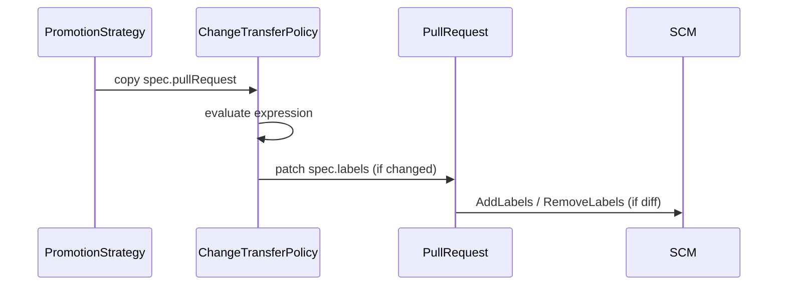

# Dynamic Pull Request Labels

GitOps Promoter can manage **SCM pull request labels** dynamically using an [expr](https://github.com/expr-lang/expr) expression. This supports Prow/Tide-style workflows where you set `autoMerge: false` on the promotion and an external bot merges when specific labels appear.

## Configure on PromotionStrategy

Configure labels at the top level of `PromotionStrategy` (not per environment). The PromotionStrategy controller copies `spec.pullRequest` onto each generated `ChangeTransferPolicy`.

```yaml
apiVersion: promoter.argoproj.io/v1alpha1
kind: PromotionStrategy
metadata:
  name: my-app
spec:
  gitRepositoryRef:
    name: my-repo
  pullRequest:
    labels:
      expression: |
        len(Status.Proposed.CommitStatuses) > 0 &&
        all(Status.Proposed.CommitStatuses, {.Phase == 'success'})
          ? ['lgtm', 'approved']
          : []
  environments:
    - branch: dev
      autoMerge: false   # let Tide/Prow merge when labels appear
    - branch: prod
```

## How it works

1. **PromotionStrategy → ChangeTransferPolicy**: `spec.pullRequest` is copied to each CTP via server-side apply.
2. **ChangeTransferPolicy → PullRequest**: The CTP controller evaluates `pullRequest.labels.expression`, validates the result, and writes `PullRequest.spec.labels` when the set changes.
3. **PullRequest → SCM**: The PullRequest controller diffs `spec.labels` against `status.appliedLabels` and calls the SCM provider to add or remove labels. On supported providers, each reconcile also reads label data from the routine open-PR check (no extra SCM call), refreshes `appliedLabels` for managed labels, and re-applies any that were removed externally.



## Expression context

Expressions are evaluated with:

| Variable | Description |
|----------|-------------|
| `Status` | `ChangeTransferPolicy.status` (proposed/active commit statuses, SHAs, etc.) |
| `Spec` | `ChangeTransferPolicy.spec` |
| `PromotionStrategy` | Owning `PromotionStrategy` object (when available) |

The expression must return a list of label name strings (`[]string`), for example `['lgtm', 'approved']` or `[]`.

## Expression examples

### Static label list

Apply the same labels on every reconcile (for example when an external bot only checks for label presence, not how they were chosen):

```yaml
pullRequest:
  labels:
    expression: "['lgtm', 'approved']"
```

Pre-create `lgtm` and `approved` in the repository only if you need specific label colors or descriptions; otherwise the promoter creates them on first apply.

### One label per commit status key

Emit an SCM label named after each **proposed** commit status gate configured on the `ChangeTransferPolicy`, plus a static `promoter` label. External automation can watch for specific gate labels, or for the full set to appear.

Gate keys may be up to 63 characters, but SCM label names are limited to 50 characters — truncate in the expression when needed:

```yaml
pullRequest:
  labels:
    expression: |
      flatten([
        ['promoter'],
        map(
          Spec.ProposedCommitStatuses,
          {len(.Key) > 50 ? .Key[:50] : .Key}
        )
      ])
```

If `security-scan` and `deployment-freeze` are configured on the environment, this returns `['promoter', 'security-scan', 'deployment-freeze']`. When the configured gate set changes, labels for removed keys are retracted (the static `promoter` label remains).

Keys come from `Spec.ProposedCommitStatuses` on each `ChangeTransferPolicy` (merged from global and per-environment `proposedCommitStatuses` on the `PromotionStrategy`).

### All gates pass, then apply a fixed set

Only add `lgtm` and `approved` when every proposed commit status is `success`:

```yaml
pullRequest:
  labels:
    expression: |
      len(Status.Proposed.CommitStatuses) > 0 &&
      all(Status.Proposed.CommitStatuses, {.Phase == 'success'})
        ? ['lgtm', 'approved']
        : []
```

This is the pattern shown in [Configure on PromotionStrategy](#configure-on-promotionstrategy) above.

## spec.labels vs metadata.labels

| Field | Meaning |
|-------|---------|
| `PullRequest.spec.labels` | SCM label names the promoter should apply on the promotion PR |
| `PullRequest.status.appliedLabels` | Labels the promoter has successfully applied (bookkeeping) |
| `PullRequest.metadata.labels` | Kubernetes correlation labels (unchanged — not SCM labels) |

## Validation

Label names must satisfy the same rules enforced on `PullRequest.spec.labels` and `status.appliedLabels`:

- Non-empty, max 50 characters per label
- No newlines or NUL characters
- Max 10 labels, unique names

Invalid expression output causes the ChangeTransferPolicy Ready condition to become False; no PullRequest patch and no SCM calls are made until the expression returns valid names.

## SCM provider support

| Provider | Label sync | Drift repair |
|----------|------------|--------------|
| GitHub, GitLab, Gitea, Forgejo | Supported; missing labels are created on add | Supported |
| Azure DevOps | Supported; missing labels are created on add | Not supported (open-PR list responses do not reliably include PR labels) |
| Bitbucket Cloud | Not supported (no PR labels API) | Not supported |

Supported providers create repository or project labels automatically when labels are first added. Pre-create labels only when you need custom colors or descriptions.

## API load and drift

Using pull request labels increases SCM API traffic: each label change can trigger `create-label`, `add-labels`, and/or `remove-labels` calls on the PullRequest API. Monitor [`scm_calls_total` and `scm_calls_duration_seconds`](../monitoring/metrics.md#scm_calls_total) filtered by `api="PullRequest"` and `operation` in (`create-label`, `add-labels`, `remove-labels`).

- **Zero SCM label calls when idle**: if `spec.labels` equals `status.appliedLabels`, the PullRequest controller skips SCM label add/remove.
- **Drift repair (supported providers)**: on each reconcile, the controller reads PR labels from the routine open-PR check. It refreshes `status.appliedLabels` for managed labels (the union of `spec.labels` and the previous `appliedLabels`, intersected with what is on the SCM). If that differs from `spec.labels`, it adds or removes labels as usual. Third-party labels on the PR (for example from Tide) are ignored.
- **Drift repair limitations**: Azure DevOps and Bitbucket Cloud do not participate — those providers do not expose PR labels in that check, so externally removed labels are not re-applied until `spec.labels` changes. This drift resolution behavior may change in a future release.
- The promoter only removes labels it previously applied (`status.appliedLabels`).

## Prow / Tide example

Set `autoMerge: false` and add labels when checks pass. Configure Tide (or another bot) to merge when `lgtm` and `approved` are present. Promotion completion is still tracked via `ExternallyMergedOrClosed` when the PR is merged outside the promoter.
