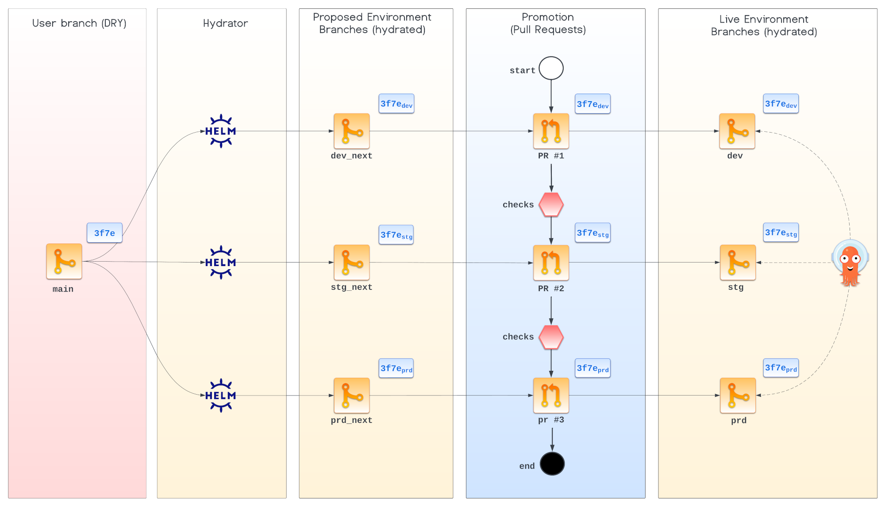
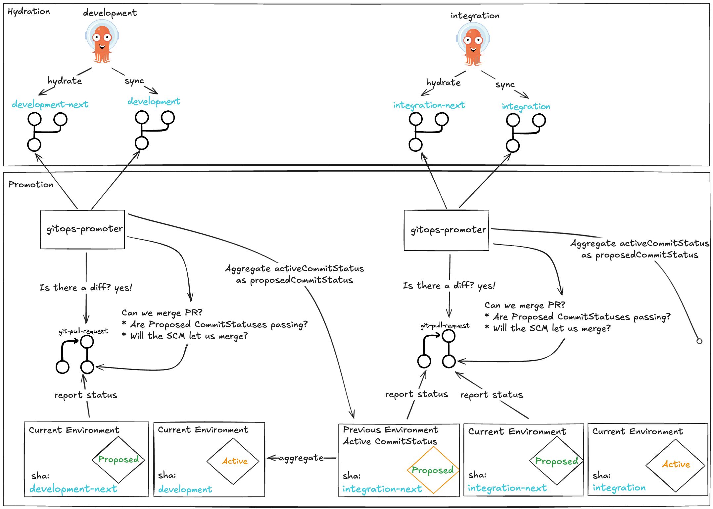

# Architecture

GitOps Promoter enables developers to "make a change and forget it." The change is made once in the "DRY branch" for all
environments, then GitOps Promoter does the work of moving the change through the environment-specific "hydrated 
branches."

This diagram shows a hypothetical setup where the "hydrator" is Helm, and the tool syncing the promoted changes is Argo
CD.

Commit `3f7e` is the user's "DRY" change that applied to all environments. The SHAs of the hydrated commits are
represented as `3f7e` with an environment-specific subscript. But in reality, the hydrated commits are different SHAs
since they are on different branches and represent environment-specific contents.

[](./assets/architecture.png)

# Controller Flow

The image illustrates the general flow of how the GitOps Promoter controller operates. The diagram 
outlines the steps involved in promoting changes through different environments in a GitOps workflow. It shows the 
interaction between various components such as the Git repository, the GitOps Promoter controller, and the environment-specific 
branches.

[](./assets/architecture-diag.png)

# Separation of Concerns

GitOps Promoter takes a "LEGO bricks" approach to designing APIs. Each API is meant to serve a clear, minimal purpose.
Multiple small parts are assembled to produce the working product.

This atomic structure makes writing and maintaining features significantly easier. Once the parts are understood, it can
also help users understand how the system works, self-diagnose issues, and build new and interesting solutions. But the
tradeoff is ease of use. Instead of creating a single CR, the user must define several. And if they make a mistake
connecting the parts, diagnosing the issue can be difficult.

We believe that, especially in the early stages of the project, this tradeoff is worth it. GitOps Environment Promotion
is inherently an advanced topic, and we expect that most users are up to the task of setting up a nontrivial system. As
the project evolves, the APIs will stabilize, and we'll have a firm foundation to evaluate adding a layer of abstraction
to simplify setup and use.

## Embedding vs. Decoupling Promotion Order

One example of the atomic "LEGO bricks" design is the separation of promotion ordering from the PromotionStrategy 
itself.

Originally, the PromotionStrategy resource maintained its own `promoter-previous-environment` commit status to enforce
linear promotion order. So to get started, all a user needed to define was this:

```yaml
kind: PromotionStrategy
spec:
  activeCommitStatuses:
    - key: argocd-health
  environments:
    - branch: environment/dev
    - branch: environment/test
    - branch: environment/prod
```

The PromotionStrategy controller would automatically inject a `promoter-previous-environment` proposedCommitStatus
for each environment (except the first one, since there is no previous environment).

Despite being "magic," this waw reasonably intuitive.

But when we started to introduce DAG support, we realized things would get complicated quickly.

```yaml
kind: PromotionStrategy
spec:
  activeCommitStatuses:
    - key: argocd-health
  environments:
    - branch: environment/dev
    - branch: environment/e2e
      dependsOn: [environment/dev]
    - branch: environment/prf
      dependsOn: [environment/dev]
    - branch: environment/prd
      dependsOn: [environment/dev, environment/prf]
  # To avoid forcing users to define trivial dependsOn fields for the linear case, we have a DAG/Linear mode toggle.
  # To support fully-custom ordering, we also have a None mode, which turns off ordering commit status injection 
  # completely.
  order: DAG 
```

Embedding the ordering information, while potentially a bit easier for the end user to set up, would force the 
PromotionStrategy API to handle multiple concerns: defining environments, setting prerequisite keys, and describing the
ordering strategy.

So for the sake of simplicity, we extracted ordering logic from the PromotionStrategy by adding two new optional
CommitStatus kinds: PreviousEnvironmentCommitStatus (linear) and DAGCommitStatus. To use them, the user would have to
create two cross-referencing resources:

```yaml
kind: PromotionStrategy
metadata:
  name: my-ps
spec:
  activeCommitStatuses:
    - key: argocd-health
  proposedCommitStatuses:
    - key: promoter-dag
  # This list just configures which environments _exist_, not how they're ordered for promotion.
  environments:
    - branch: environment/dev
    - branch: environment/test
    - branch: environment/prod
---
kind: DAGCommitStatus
spec:
  key: promoter-dag
  promotionStrategyRef:
    name: my-ps
  # This list configures how environments are ordered for promotion.
  environments:
    - branch: environment/dev
    - branch: environment/e2e
      dependsOn: [environment/dev]
    - branch: environment/prf
      dependsOn: [environment/dev]
    - branch: environment/prd
      dependsOn: [environment/dev, environment/prf]
```

The linear case is a bit simpler, because it just infers order from the PromotionStrategy spec:

```yaml
kind: PromotionStrategy
metadata:
  name: my-ps
spec:
  activeCommitStatuses:
    - key: argocd-health
  proposedCommitStatuses:
    - key: promoter-previous-environment
  environments:
    - branch: environment/dev
    - branch: environment/test
    - branch: environment/prod
---
kind: PreviousEnvironmentCommitStatus
spec:
  key: promoter-previous-environment
  promotionStrategyRef:
    name: my-ps
```

Both of these are admittedly a bit more complicated to define than the unified PromotionStrategy. But the behavior of
each piece is a bit easier to understand and much easier to implement/maintain.

## Maintaining a Strong UX

While strong separation of concerns brings a lot of benefits, the cost to the user in ease of use is undeniable. So we
mitigate the difficult UX in a few ways:

1) Provide excellent examples in docs: most setups start with copy/paste
2) Provide clear error messages: when there's a predictable misconfiguration, provide a message describing exactly how 
   to fix the problem

## Future Improvements

In the future, we may introduce unifying APIs to help users get started quickly. This would likely involve embedding
other APIs in a parent resource that just creates and maintains the atomic CRs. For example:

```yaml
kind: UnifiedPromotionStrategy
spec:
  gitRepository:
    owner: example-org
    repo: example-repo
    github:
      secretRef:
        name: gh-secret
  activeCommitStatuses:
  - argoCD:
      applicationSelector:
        labels:
          app-name: my-app
  order: DAG
  environments:
    - branch: environment/dev
    - branch: environment/e2e
      dependsOn: [environment/dev]
    - branch: environment/prf
      dependsOn: [environment/dev]
    - branch: environment/prd
      dependsOn: [environment/dev, environment/prf]
```

This API will require careful design, a process that will benefit from a strong set of stable underlying APIs. The more
we stabilize the atomic APIs, the easier defining this unified API will become.
