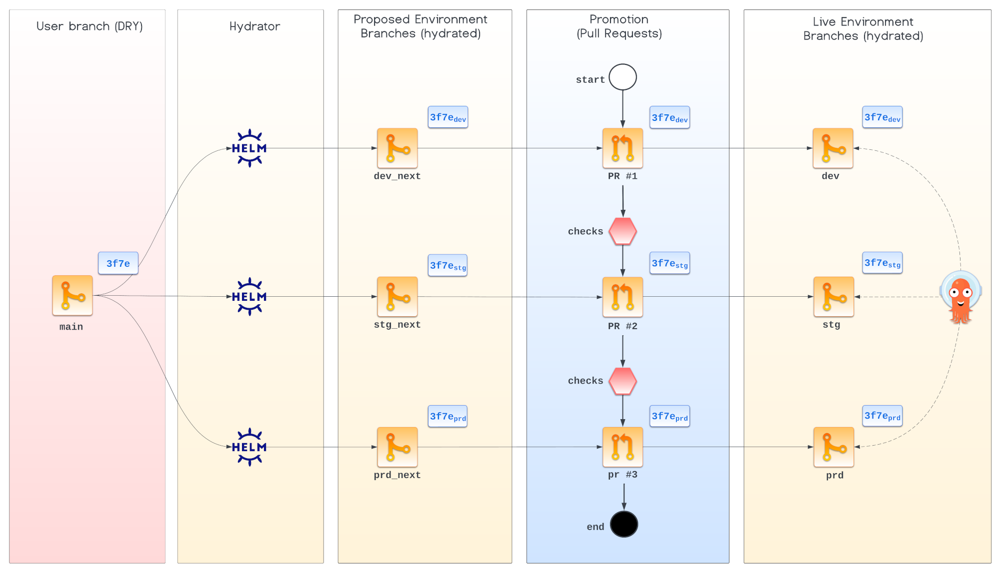

# Architecture

GitOps Promoter enables developers to "make a change and forget it." The change is made once in the "DRY branch" for all
environments, then GitOps Promoter does the work of moving the change through the environment-specific "hydrated 
branches."

This diagram shows a hypothetical setup where the "hydrator" is Helm, and the tool syncing the promoted changes is Argo
CD.

Commit `3f7e` is the user's "DRY" change that applied to all environments. The SHAs of the hydrated commits are
represented as `3f7e` with an environment-specific subscript. But in reality, the hydrated commits are different SHAs
since they are on different branches and represent environment-specific contents.

