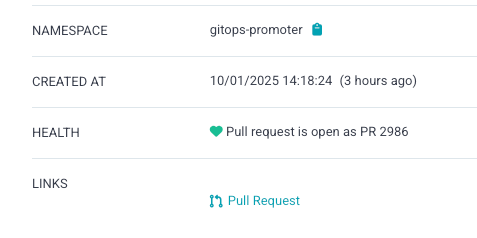

Argo CD supports a variety of integrations with external systems to improve the user experience. Here are some
integrations you can enable to improve your Argo CD experience while using GitOps Promoter.

## UI Extension

GitOps Promoter provides a custom [Argo CD UI Extension](https://argo-cd.readthedocs.io/en/stable/developer-guide/extensions/ui-extensions/).

An easy way to install the extension is to use the [argocd-extension-installer](https://github.com/argoproj-labs/argocd-extension-installer).

You can use it by adding an init container to your `argocd-server` deployment. Here is an example:

```yaml
apiVersion: apps/v1
kind: Deployment
metadata:
  name: argocd-server
spec:
  template:
    spec:
      initContainers:
        - name: extension-gitops-promoter
          image: quay.io/argoprojlabs/argocd-extension-installer:v0.0.9@sha256:d2b43c18ac1401f579f6d27878f45e253d1e3f30287471ae74e6a4315ceb0611
          env:
            - name: EXTENSION_NAME
              value: gitops-promoter
            - name: EXTENSION_URL
              value: https://github.com/argoproj-labs/gitops-promoter/releases/download/v0.20.2/gitops-promoter-argocd-extension.tar.gz
            - name: EXTENSION_CHECKSUM_URL
              value: https://github.com/argoproj-labs/gitops-promoter/releases/download/v0.20.2/gitops-promoter_0.20.2_checksums.txt
          volumeMounts:
            - name: extensions
              mountPath: /tmp/extensions/
          securityContext:
            runAsUser: 1000
            allowPrivilegeEscalation: false
      containers:
        - name: argocd-server
          volumeMounts:
            - name: extensions
              mountPath: /tmp/extensions/
      volumes:
        - name: extensions
          emptyDir: {}
```

## Deep Links

Argo CD supports [deep links](https://argo-cd.readthedocs.io/en/stable/operator-manual/deep_links/) from a resource's details
page. This allows us to link directly from a [ChangeTransferPolicy](crd-specs.md#changetransferpolicy) or a
[PullRequest](crd-specs.md#pullrequest) to the PR page in your SCM provider.



To enable these deep links, add the following to your `argocd-cm` ConfigMap:

```yaml
  resource.links: |
    - url: '{{.resource.status.url}}'
      title: Pull Request
      icon.class: fa-code-pull-request
      if: resource.apiVersion == "promoter.argoproj.io/v1alpha1" && resource.kind == "PullRequest" && resource.status.url != nil && resource.status.url != ""
    - url: '{{.resource.status.pullRequest.url}}'
      title: Pull Request
      icon.class: fa-code-pull-request
      if: resource.apiVersion == "promoter.argoproj.io/v1alpha1" && resource.kind == "ChangeTransferPolicy" && resource.status.pullRequest != nil && resource.status.pullRequest.url != nil && resource.status.pullRequest.url != ""
```

## Commit Status Keys in Resource Tree

Argo CD supports [showing values of specific labels in the resource tree](https://argo-cd.readthedocs.io/en/stable/operator-manual/declarative-setup/#resource-custom-labels).


To enable this, add the following to your `argocd-cm` ConfigMap:

```yaml
  resource.customLabels: promoter.argoproj.io/commit-status
```
