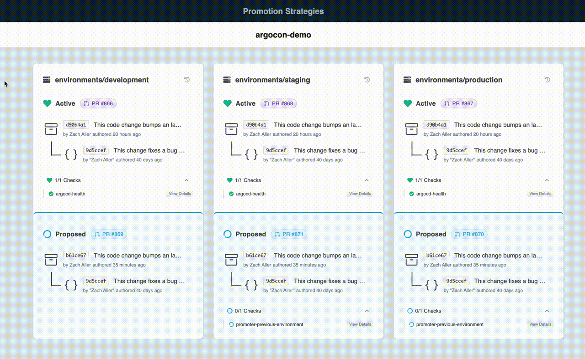

# Getting Started

This guide will help you get started installing and setting up the GitOps Promoter. We currently support
GitHub, GitHub Enterprise, GitLab, Forgejo (including Codeberg), Gitea, Bitbucket Cloud, and Azure DevOps as the SCM providers. We would welcome any contributions to add support for other providers.

## Requirements

* kubectl CLI
* kubernetes cluster
* GitHub or GitHub Enterprise Application
  * Will take PRs to add support for other SCM providers

## Installation

To install GitOps Promoter, you can use the following command:

```bash
kubectl apply -f https://github.com/argoproj-labs/gitops-promoter/releases/download/v0.20.2/install.yaml
```

## GitHub App Configuration

You will need to [create a GitHub App](https://docs.github.com/en/developers/apps/creating-a-github-app) and configure
it to allow the GitOps Promoter to interact with your GitHub repository.

During the creation the GitHub App, you will need to configure the following settings:

### Permissions

| Action         | Permission     |
| -------------- | -------------- |
| `Checks`       | Read and write |
| `Contents`     | Read and write |
| `Pull requests`| Read and write |

### Webhooks (Optional - but highly recommended)

> [!NOTE]
> We do support configuration of a GitHub App webhook that triggers PR creation upon Push. However, we do not configure
> the ingress to allow GitHub to reach the GitOps Promoter. You will need to configure the ingress to allow GitHub to reach
> the GitOps Promoter via the service promoter-webhook-receiver which listens on port `3333`. If you do not use webhooks
> you might want to adjust the auto reconciliation interval to a lower value using these `promotionStrategyRequeueDuration` and
> `changeTransferPolicyRequeueDuration` fields of the `ControllerConfiguration` resource.

Webhook URL: `https://<your-promoter-webhook-receiver-ingress>/`

Here is an example Ingress configuration for the webhook receiver:

```yaml
apiVersion: networking.k8s.io/v1
kind: Ingress
metadata:
  name: promoter-webhook-receiver
  namespace: promoter-system
  annotations:
    # Add any necessary annotations for your ingress controller
    # For example, if using nginx-ingress:
    # nginx.ingress.kubernetes.io/ssl-redirect: "true"
spec:
  rules:
  - host: argo-github-app-webhook.com  # Replace with your domain
    http:
      paths:
      - path: /
        pathType: Prefix
        backend:
          service:
            name: promoter-webhook-receiver
            port:
              number: 3333
```

### Usage

The GitHub App will generate a private key that you will need to save. You will also need to get the App ID and the
installation ID in a secret as follows:

```yaml
apiVersion: v1
kind: Secret
metadata:
  name: <your-secret-name>
type: Opaque
stringData:
  githubAppPrivateKey: <your-private-key>
```

> [!NOTE]
> This Secret will need to be installed to the same namespace that you plan on creating PromotionStrategy resources in.

We also need a GitRepository and ScmProvider, which are custom resources that represent a git repository and a provider.
Here is an example of both resources:

```yaml
apiVersion: promoter.argoproj.io/v1alpha1
kind: ScmProvider
metadata:
  name: <your-scmprovider-name>
spec:
  secretRef:
    name: <your-secret-name> # The secret that contains the GitHub App configuration
  github:
    appID: <your-app-id>
    installationID: <your-installation-id> # Optional, will query ListInstallations if not provided
---
apiVersion: promoter.argoproj.io/v1alpha1
kind: GitRepository
metadata:
  name: <git-repository-ref-name>
spec:
  github:
    name: <repo-name>
    owner: <github-org-username>
  scmProviderRef:
    name: <your-scmprovider-name>
```

> [!IMPORTANT]
> Make sure your staging branches (`environment/development-next`, `environment/staging-next`, etc.) are not auto-deleted
> when PRs are merged. You can do this either by disabling auto-deletion of branches in the repository settings (in
> Settings > Automatically delete head branches) or by adding a branch protection rule for a matching pattern such as
> `environment/*-next` (`/` characters are separators in GitHub's glob implementation, so `*-next` will not work).

> [!NOTE]
> The GitRepository and ScmProvider also need to be installed to the same namespace that you plan on creating PromotionStrategy
> resources in, and it also needs to be in the same namespace of the secret it references.

## GitLab Configuration

To configure the GitOps Promoter with GitLab, you will need to create a GitLab Access Token under the "Developer" role with `api` and `write_repository` scopes and configure the necessary resources to allow the promoter to interact with your repository. This Access Token should be used in a secret as follows:

```yaml
apiVersion: v1
kind: Secret
metadata:
  name: <your-secret-name>
type: Opaque
stringData:
  token: <your-access-token>
```

We also need a GitRepository and ScmProvider, which is are custom resources that represents a git repository and a provider.
Here is an example of both resources:

```yaml
apiVersion: promoter.argoproj.io/v1alpha1
kind: ScmProvider
metadata:
  name: <your-scmprovider-name>
spec:
  secretRef:
    name: <your-secret-name>
  gitlab: {}
---
apiVersion: promoter.argoproj.io/v1alpha1
kind: GitRepository
metadata:
  name: <git-repository-ref-name>
spec:
  gitlab:
    name: <repo-name>
    namespace: <user-or-group-with-subgroups>
    projectId: <project-id>
  scmProviderRef:
    name: <your-scmprovider-name> # The secret that contains the GitLab Access Token
```

## Gitea Configuration

To configure GitOps Promoter with Gitea, you will need to create an access token. See the [official Gitea documentation](https://docs.gitea.com/development/api-usage#generating-and-listing-api-tokens) for creating access tokens. The token needs `read and write` repository permissions.

This token should be in a secret as follows:

```yaml
apiVersion: v1
kind: Secret
metadata:
  name: <your-secret-name>
type: Opaque
stringData:
  token: <your-access-token>
```

Alternatively, while it is not recommended you can use basic HTTP authentication against your Gitea instance:

```yaml
apiVersion: v1
kind: Secret
metadata:
  name: <your-secret-name>
type: Opaque
stringData:
  username: <your-user>
  password: <your-password>
```

**Note:** This will not work if your user/bot account has MFA/2FA enabled.

We also need a GitRepository and ScmProvider, which are custom resources that represent a git repository and a provider.
Here is an example of both resources:

```yaml
apiVersion: promoter.argoproj.io/v1alpha1
kind: ScmProvider
metadata:
  name: <your-scmprovider-name>
spec:
  secretRef:
    name: <your-secret-name>
  gitea:
    domain: <your-gitea-domain> # e.g., gitea.com or gitea.mycompany.com
---
apiVersion: promoter.argoproj.io/v1alpha1
kind: GitRepository
metadata:
  name: <git-repository-ref-name>
spec:
  gitea:
    owner: <organization-or-user-name>
    name: <repo-name>
  scmProviderRef:
    name: <your-scmprovider-name>
```

## Forgejo Configuration

To configure Gitops Promoter with Forgejo, you will need to configure an App. The process is very similar to Codeberg. Here is the [official Codeberg documentation](https://docs.codeberg.org/advanced/access-token/) (note: Codeberg is powered by Forgejo under the hood). Give the `read and write` Token the permissions on the repository.

This Token should be in a secret as follow:

```yaml
apiVersion: v1
kind: Secret
metadata:
  name: <your-secret-name>
type: Opaque
stringData:
  token: <your-access-token>
```

Alternatively, you can use basic http authentication against your Forgejo instance:

```yaml
apiVersion: v1
kind: Secret
metadata:
  name: <your-secret-name>
type: Opaque
stringData:
  username: <your-user>
  password: <your-password>
```

We also need a GitRepository and ScmProvider, which is are custom resources that represents a git repository and a provider.
Here is an example of both resources:

```yaml
apiVersion: promoter.argoproj.io/v1alpha1
kind: ScmProvider
metadata:
  name: <your-scmprovider-name>
spec:
  secretRef:
    name: <your-secret-name>
  forgejo: {}
---
apiVersion: promoter.argoproj.io/v1alpha1
kind: GitRepository
metadata:
  name: <git-repository-ref-name>
spec:
  forgejo:
    owner: <organization-or-user-name>
    name: <repo-name>
  scmProviderRef:
    name: <your-scmprovider-name> # The secret that contains the GitLab Access Token
```

## Bitbucket Cloud Configuration

To configure the GitOps Promoter with Bitbucket Cloud, you will need to create a repository access token with the appropriate permissions and configure the necessary resources to allow the promoter to interact with your repository.

### Creating a Bitbucket Cloud Repository Access Token

1. Navigate to your repository URL
2. Click on "Repository settings" in the sidebar
3. Navigate to "Access tokens"
4. Click "Create access token"
5. Give it a name (e.g., "GitOps Promoter")
6. Select the following permissions:
   * **Repositories**: Read and Write
   * **Pull requests**: Read and Write

## Azure DevOps Configuration

To configure Gitops Promoter with Azure Devops, you will need to create a Personal Access Token (PAT).
### ScmProvider
#### PAT
Create an PAT in Azure Devops, that has 'Read & Write' on scope 'Code'.

```yaml
apiVersion: v1
kind: Secret
metadata:
  name: <your-secret-name>
type: Opaque
stringData:
  token: <your-access-token>
---
apiVersion: promoter.argoproj.io/v1alpha1
kind: ScmProvider
metadata:
  name: <your-scmprovider-name>
spec:
  secretRef:
    name: <your-secret-name>
  azureDevOps:
    organization: <your-azdo-organization>
```

### GitRepository

We also need a GitRepository referencing the ScmProvider

```yaml
apiVersion: promoter.argoproj.io/v1alpha1
kind: GitRepository
metadata:
  name: <git-repository-ref-name>
spec:
  azureDevOps:
    project: <project-name>
    name: <repo-name>
  scmProviderRef:
    name: <your-scmprovider-name>
 ```

### Webhooks (Optional - but highly recommended)

> [!NOTE]
> We do support configuration of a Bitbucket Cloud webhook that triggers PR creation upon Push. However, we do not configure
> the ingress to allow Bitbucket Cloud to reach the GitOps Promoter. You will need to configure the ingress to allow Bitbucket Cloud to reach
> the GitOps Promoter via the service promoter-webhook-receiver which listens on port `3333`. If you do not use webhooks
> you might want to adjust the auto reconciliation interval to a lower value using these `promotionStrategyRequeueDuration` and
> `changeTransferPolicyRequeueDuration` fields of the `ControllerConfiguration` resource.

To enable webhook support for automatic PR creation on push:

1. Navigate to your repository URL
2. Click on "Repository settings" in the sidebar
3. Navigate to "Webhooks"
4. Click "Add webhook"
5. Configure the webhook:
   * **Title**: GitOps Promoter
   * **URL**: `https://argo-github-app-webhook.com/` # Replace with your domain
   * **Triggers**: Select "Repository: Push"

Here is an example Ingress configuration for the webhook receiver:

```yaml
apiVersion: networking.k8s.io/v1
kind: Ingress
metadata:
  name: promoter-webhook-receiver
  namespace: promoter-system
  annotations:
    # Add any necessary annotations for your ingress controller
    # For example, if using nginx-ingress:
    # nginx.ingress.kubernetes.io/ssl-redirect: "true"
spec:
  rules:
  - host: argo-github-app-webhook.com  # Replace with your domain
    http:
      paths:
      - path: /
        pathType: Prefix
        backend:
          service:
            name: promoter-webhook-receiver
            port:
              number: 3333
```

### Configuration

This access token should be used in a secret as follows:

```yaml
apiVersion: v1
kind: Secret
metadata:
  name: <your-secret-name>
type: Opaque
stringData:
  token: <your-repository-access-token>
```

We also need a GitRepository and ScmProvider, which are custom resources that represent a git repository and a provider.
Here is an example of both resources:

```yaml
apiVersion: promoter.argoproj.io/v1alpha1
kind: ScmProvider
metadata:
  name: <your-scmprovider-name>
spec:
  secretRef:
    name: <your-secret-name>
  bitbucketCloud: {}
---
apiVersion: promoter.argoproj.io/v1alpha1
kind: GitRepository
metadata:
  name: <git-repository-ref-name>
spec:
  bitbucketCloud:
    owner: <owner-or-workspace-name>
    name: <repo-name>
  scmProviderRef:
    name: <your-scmprovider-name>
```

> [!NOTE]
> The GitRepository and ScmProvider also need to be installed to the same namespace that you plan on creating PromotionStrategy resources in, and it also needs to be in the same namespace of the secret it references.

## Promotion Strategy

The PromotionStrategy resource is the main resource that you will use to configure the promotion of your application to different environments.
Here is an example PromotionStrategy resource:

```yaml
apiVersion: promoter.argoproj.io/v1alpha1
kind: PromotionStrategy
metadata:
  name: demo
spec:
  environments:
  - autoMerge: false
    branch: environment/development
  - autoMerge: false
    branch: environment/staging
  - autoMerge: false
    branch: environment/production
  gitRepositoryRef:
    name: <git-repository-ref-name> # The name of the GitRepository resource
```

> [!IMPORTANT]
> Each `branch` configured here is the branch that GitOps Promoter will merge into. Your [hydrator](index.md#prerequisites)
> configuration must hydrate to these branch names, but **suffixed with `-next`**. This convention is hard-coded in
> GitOps Promoter.
>
> For an example of how to configure the Argo CD Source Hydrator, see the [Argo CD tutorial](tutorial-argocd-apps.md#deploy-an-application-for-3-environments).
> (Note the difference between the `syncSource` and the `hydrateTo` fields.)

> [!NOTE]
> Notice that the branches are prefixed with `environment/`. This is a convention that we recommend you follow.

> [!NOTE]
> The `autoMerge` field is optional and defaults to `true`. We set it to `false` here because we do not have any
> CommitStatus checks configured. With these all set to `false` we will have to manually merge the PRs.

## Launching the UI

GitOps Promoter comes with a web UI that you can use to visualize the state of your PromotionStrategy resources.

To launch the UI, first download the gitops-promoter CLI from the [releases page](https://github.com/argoproj-labs/gitops-promoter/releases).

Make the file executable and add it to your PATH.

Then run the following command:

```bash
gitops-promoter dashboard
```

The UI will be available at `http://localhost:8080`.

To use a different port, you can use the `--port` flag.

By default, the UI uses your current kubeconfig context. If you want to use a different context, you can use the `--kubecontext` flag.

```bash
gitops-promoter dashboard --port <your-port> --kubecontext <your-kube-context>
```


